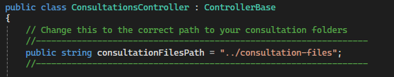
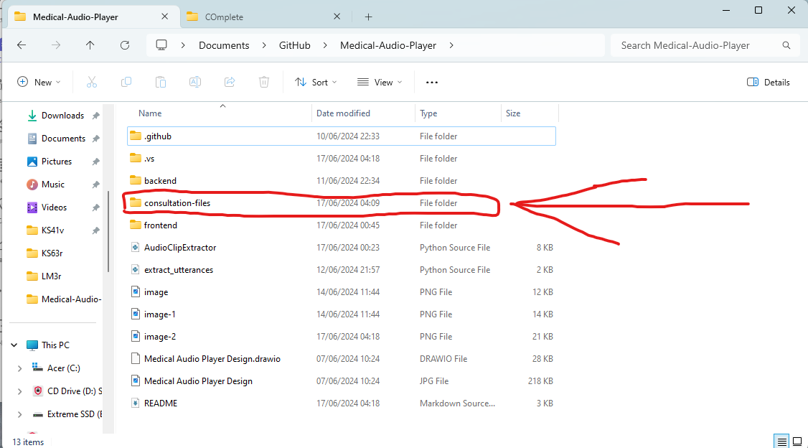
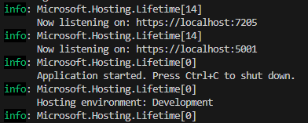
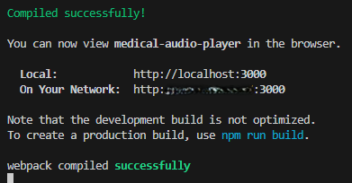

# Medical Consultation Audio Player

Medical Consultation Audio player built to play audio files of doctor - robot - patient consultations, and display them in a suitable manner.

## Features

- Audio Player: Play audio files of doctor - robot - patient consultations.

- Consultation page: Select a consultation to play.

- Settings: Change the conversation party combination for playback of audio files and dark mode toggle.

## Installation Steps
Follow these steps to run the Medical Consultation Player

### Prerequisites

- NET 6.0 Long Term Support SDK - https://download.visualstudio.microsoft.com/download/pr/0814dade-52c0-4f97-83f4-21f784b03a2e/6f0d4b4dc596824a365b63882982031b/dotnet-sdk-6.0.423-win-x64.exe - Required to run the backend
- Node.js version 20.12.2 or later - https://nodejs.org/en/download/prebuilt-installer - Required to run the frontend

### 1 - Clone the repository or download the zip file
First, clone the repository to your local machine:

https://github.com/Swattle1/Medical-Audio-Player.git

- cd Medical-Audio-Player

### 2 - Setup Backend
Open a terminal of your choice and navigate to the backend directory and restore the .NET dependencies or run in Visual Studio:

- cd backend

- dotnet restore

Run the backend server:

- NOTE - BEFORE RUNNING THE BACKEND YOU WILL HAVE TO CHANGE THIS LINE TO THE PATH OF YOUR PREPARED CONSULTATION FILES:
This change is in "/Medical-Audio-Player/backend/Controllers/ConsultationsController.cs":

The image above shows a folder in the path "/Medical-Audio-Player/consultation-files" to the consultation files, your folder may be called something else, which is why you may need to change it as shown above.

- dotnet run

- Upon Starting the backend it should display the ports it is listening on:

### 3 - Setup Frontend
Before starting the frontend, ensure that the backend server is running and note the port it is listening on (e.g., 7205, 5001, or another default value). You may need to manually update the `REACT_APP_API_URL` value in the frontend `.env` file to match the backend port before proceeding.

Open another terminal and navigate to the frontend directory within the cloned repository.

- cd frontend

- npm install

This will install all necessary dependencies.

Now start the Application frontend:

- npm start

This should show you something like this: 

## Usage

Once the server backend is running, you can access the API at the following endpoints:

- React App: (http://localhost:3000)
- SwaggerUI Documentation: (http://localhost:7205/index.html) or (http://localhost:7205/) or (http://localhost:5001/index.html)